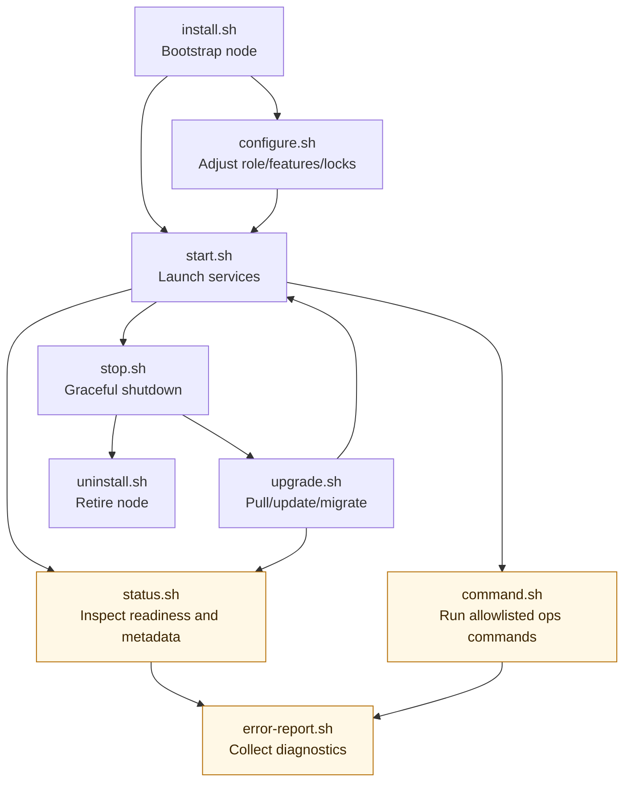

# Install & Lifecycle Scripts Manual

> **Single source of truth:** Keep operational flag and behavior details in this file. Update `apps/docs/cookbooks/install-start-stop-upgrade-uninstall.md` only with role-oriented guidance and a link back here.

This is the canonical reference for Linux lifecycle scripts: `install.sh`, `start.sh`, `stop.sh`, `status.sh`, `command.sh`, `upgrade.sh`, `configure.sh`, `error-report.sh`, and `uninstall.sh`.

## Lifecycle map (operator contract)

This map is a regression guardrail: lifecycle changes should preserve these operator touchpoints unless the manual and tests are updated together.

## Git remotes for preloaded environments

If this repository is provided without Git remotes configured, `configure.sh`, `install.sh`, and `upgrade.sh` add the official Arthexis GitHub remote as `upstream`. If no `origin` is configured, they also set `origin` to `https://github.com/arthexis/arthexis`.

## 1. Installation (`install.sh`)

`install.sh` installs dependencies, prepares `.venv`, applies environment refresh and migration flow, writes lock files, and optionally provisions service units.

### 1.1 Supported flags

| Flag | Notes |
| --- | --- |
| `--service NAME` | Set service name stored in `.locks/service.lck` and used for managed units. |
| `--port PORT` | Set backend port lock (`.locks/backend_port.lck`). |
| `--upgrade` | Allow install flow to run in upgrade mode (reuses existing DB state paths). |
| `--auto-upgrade` | Enable auto-upgrade lock behavior. |
| `--fixed` | Disable auto-upgrade lock behavior. |
| `--latest`, `--unstable` | Enable auto-upgrade and set latest/unstable channel. |
| `--stable`, `--lts` | Enable auto-upgrade and set stable/LTS channel. |
| `--regular`, `--normal` | Enable auto-upgrade and set regular/normal channel. |
| `--celery` | Enable Celery lock and related unit handling. |
| `--embedded` | Force embedded service mode. |
| `--systemd` | Force systemd service mode. |
| `--lcd-screen`, `--no-lcd-screen` | Toggle LCD lock and associated units/features. |
| `--rfid-service`, `--no-rfid-service` | Toggle RFID service lock and related units. |
| `--camera-service`, `--no-camera-service` | Toggle camera service lock and related units. |
| `--boot-upgrade`, `--no-boot-upgrade` | Toggle boot-upgrade lock (`boot-upgrade.lck`). |
| `--clean` | Remove prior installation state (backs up DB before deletion). |
| `--start`, `--no-start` | Explicitly start or skip startup at end of install. |
| `--repair` | Repair mode using stored lock/service state. |
| `--satellite`, `--terminal`, `--control`, `--watchtower` | Role presets that set role defaults and related feature locks. |

## 2. Start and stop

## 2.1 Startup (`start.sh`)

`start.sh` starts managed systemd units when configured; otherwise it delegates to `scripts/service-start.sh`.

### Supported flags

| Flag | Notes |
| --- | --- |
| `--silent` | Exit immediately after restart path where applicable. |
| `--reload` | Forward reload request to service launcher. |
| `--debug` | Enable debug mode behavior in startup path. |
| `--show LEVEL` | Set log level handling (`DEBUG`, `INFO`, `WARNING`, `ERROR`, `CRITICAL`). |
| `--log-follow` | Follow logs during startup. |
| `--clear-logs` | Stop services first, then clear logs before startup. |

Other arguments are passed through to `scripts/service-start.sh`.

## 2.2 Shutdown (`stop.sh`)

`stop.sh` stops managed units when present, else stops runserver/Celery processes by PID and process matching.

### Supported flags/args

| Flag/arg | Notes |
| --- | --- |
| `PORT` (positional) | Stop server associated with the provided port. Defaults to detected backend port. |
| `--all` | Stop all matching runserver instances. |
| `--force` | Force stop path for guarded conditions. |
| `--confirm` | Confirm stop flow in guarded conditions. |

## 3. Upgrades (`upgrade.sh`)

`upgrade.sh` handles git synchronization, environment refresh, migrations, optional cleanup, and service stop/start orchestration.

### Supported flags

| Flag | Notes |
| --- | --- |
| `--latest`, `--unstable`, `-l`, `-t` | Use latest/unstable channel behavior. |
| `--stable`, `--lts` | Use stable/LTS channel behavior. |
| `--normal`, `--regular` | Use regular/normal channel behavior. |
| `--force`, `-f` | Force stop/upgrade when needed. |
| `--confirm` | Enable confirmation for stop operations. |
| `--stash` | Force auto-stash of local changes before upgrade. |
| `--force-refresh` | Force environment/dependency refresh steps. |
| `--clean` | Run clean-upgrade mode (destructive DB cleanup path with warning unless bypassed). |
| `--migrate` | Rebuild schema from current migrations and reconcile compatible rows from a pre-migration snapshot (supported on SQLite and PostgreSQL only; mutually exclusive with `--clean`). |
| `--reconcile` | Keep normal upgrade flow, but auto-retry with reconciliation only when migration graph/version mismatches are detected. |
| `--no-start`, `--no-restart` | Keep services stopped after upgrade. |
| `--start`, `-s` | Force startup after upgrade. |
| `--stop` | Stop services and exit (no restart). |
| `--no-warn` | Skip destructive-operation warning prompts. |
| `--pre-check` | Run pre-check behavior only. |
| `--no-check` | Disable pre-check behavior. |
| `--clear-logs` | Clear logs as part of upgrade flow. |
| `--clear-work` | Clear `work/` contents as part of upgrade flow. |
| `--local` | Continue from local sources without remote pull. |
| `--detached` | Run delegated detached upgrade flow. |
| `--check` | Check-only mode (no upgrade actions). |
| `--revert` | Revert to pre-upgrade revision lock target. |
| `--branch NAME` | Upgrade against a specific branch. |
| `--main` | Shortcut for `--branch main`. |

### `--migrate` backend behavior

`upgrade.sh --migrate` delegates to `env-refresh.py --migrate` and always forces a clean migration cycle before reconciliation.

`upgrade.sh --reconcile` delegates to `env-refresh.py --reconcile` and does **not** force a clean cycle upfront; it only retries with reconciliation after a migration graph/version mismatch is detected.

- **SQLite (`django.db.backends.sqlite3`)**
  - Creates `.locks/<db>.pre_major_migrate.sqlite3`.
  - Rebuilds schema from current migrations.
  - Reconciles shared tables using `INSERT OR IGNORE`.
- **PostgreSQL (`django.db.backends.postgresql`)**
  - Creates `.locks/<db>.pre_major_migrate.dump` via `pg_dump --format=custom`.
  - Rebuilds schema from current migrations.
  - Restores the dump into a temporary database (`arthexis_pre_major_migrate_snapshot`) and reconciles compatible rows into the active DB with conflict-tolerant inserts (`ON CONFLICT DO NOTHING`).
- **Other backends**
  - `--migrate` is rejected with a clear `CommandError`.

Both supported backends emit a consistent reconciliation report that includes copied tables, legacy-only/new-schema-only tables, skipped tables, skipped columns, and row-conflict skips.

## 4. Runtime reconfiguration (`configure.sh`)

`configure.sh` updates lock-driven settings without full reinstall.

### Supported flags

| Flag | Notes |
| --- | --- |
| `--service NAME` | Set service name lock. |
| `--port PORT` | Set backend port lock. |
| `--latest`, `--unstable` | Set latest/unstable channel for auto-upgrade. |
| `--stable`, `--lts` | Set stable/LTS channel for auto-upgrade. |
| `--regular`, `--normal` | Set regular/normal channel for auto-upgrade. |
| `--fixed` | Disable auto-upgrade. |
| `--auto-upgrade`, `--no-auto-upgrade` | Explicitly enable/disable auto-upgrade. |
| `--debug`, `--no-debug` | Toggle debug env setting. |
| `--celery`, `--no-celery` | Toggle Celery lock/units. |
| `--lcd-screen`, `--no-lcd-screen` | Toggle LCD lock/units. |
| `--rfid-service`, `--no-rfid-service` | Toggle RFID lock/units. |
| `--camera-service`, `--no-camera-service` | Toggle camera lock/units. |
| `--boot-upgrade`, `--no-boot-upgrade` | Toggle boot-upgrade lock. |
| `--feature SLUG` | Target feature for state query/toggle. |
| `--kind suite|node` | Scope for `--feature`. |
| `--enabled`, `--disabled` | Enable/disable selected feature. |
| `--feature-param FEATURE:KEY=VALUE` | Set feature metadata parameter. |
| `--email ADMIN_EMAIL` | Set `DEFAULT_ADMIN_EMAIL` in `arthexis.env` for upgrade notifications. |
| `--satellite`, `--terminal`, `--control`, `--watchtower` | Set role profile and associated defaults. |
| `--check` | Print current role/port/upgrade/debug/feature state. |
| `--repair` | Restore lock state from existing role and lock files. |
| `--failover ROLE` | Provide role fallback for repair when role lock cannot be resolved. |

Auto-upgrade channel tiers gate release bumps after the scheduler fires:
`stable`/`lts` allows patch upgrades weekly and minor upgrades monthly,
`regular`/`normal` allows patch and minor upgrades daily and major upgrades
weekly, and `latest`/`unstable` follows live `main` revisions daily.

## 5. Runtime status (`status.sh`)

`status.sh` reports installation metadata, configured role/service/port state, upgrade in-progress markers, and service reachability probes.

### Supported flags

| Flag | Notes |
| --- | --- |
| `-h`, `--help` | Print usage and exit successfully. |
| `--wait` | Poll until reachability checks succeed or timeout windows expire. |

## 6. Operational command entrypoint (`command.sh`)

`command.sh` is the allowlisted operational command wrapper. It validates the runtime environment, logs invocation metadata safely, and dispatches to `utils.command_api`.

### Interface contract

| Invocation | Notes |
| --- | --- |
| `./command.sh list` | Show allowlisted operational commands. |
| `./command.sh <operational-command> [args...]` | Run one allowlisted ops command. |

For non-ops/admin Django commands, use `.venv/bin/python manage.py ...` directly.

## 7. Uninstall (`uninstall.sh`)

`uninstall.sh` tears down managed units, local locks, and local SQLite DB.

### Supported flags

| Flag | Notes |
| --- | --- |
| `--service NAME` | Override service name discovery. |
| `--no-warn` | Skip DB deletion warning prompt. |
| `--rfid-service`, `--no-rfid-service` | Control whether RFID unit/lock is removed during uninstall. |

## 8. Error report (`error-report.sh`)

`error-report.sh` builds a single diagnostic zip without invoking Django
management commands. It is intended for startup, upgrade, migration, and
environment failures where `command.sh` or `manage.py` may not work.

### Supported flags

| Flag | Notes |
| --- | --- |
| `--output-dir DIR` | Directory for generated zip files. Defaults to `work/error-reports`. |
| `--since DURATION` | Include non-critical logs modified within a duration such as `12h` or `7d`. |
| `--max-log-files COUNT` | Cap selected log files. Defaults to `30`. |
| `--max-file-bytes BYTES` | Copy only the tail of large text files. Defaults to `262144`. |
| `--upload-url URL` | Upload the generated zip to an explicit signed URL after writing it locally. |
| `--upload-method METHOD` | Upload method, `PUT` or `POST`. Defaults to `PUT`. |
| `--upload-timeout SECONDS` | Upload timeout. Defaults to `60`. |
| `--allow-insecure-upload` | Permit `http://` upload URLs. HTTPS is required by default. |
| `--dry-run` | Print planned report contents without writing a zip or uploading. |
| `-h`, `--help` | Print usage and exit successfully. |

The collector uses Python standard library modules only and passes copied text
through secret redaction. It excludes environment files, databases, dumps,
backups, media/static/cache trees, virtual environments, Git internals, and key
material. See `docs/operations/error-report.md` for operator usage and package
contents.

## 9. Documentation maintenance check

When lifecycle script docs are updated:

1. Check each script `usage()` output.
2. Check each script argument parser block (`case ... in`).
3. Remove stale aliases/options and avoid operational cadence claims unless they are explicitly enforced by script logic.
