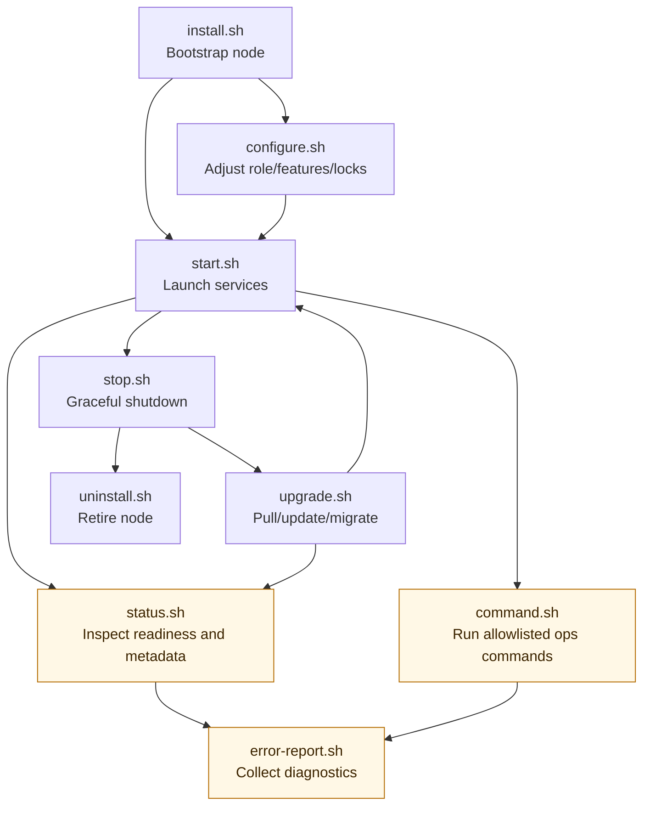

# Install & Lifecycle Scripts Manual

> **Single source of truth:** Keep operational flag and behavior details in this file. Update `apps/docs/cookbooks/install-start-stop-upgrade-uninstall.md` only with role-oriented guidance and a link back here.

This is the canonical reference for Linux lifecycle scripts: `install.sh`, `start.sh`, `stop.sh`, `status.sh`, `command.sh`, `upgrade.sh`, `configure.sh`, `error-report.sh`, and `uninstall.sh`.


## Lifecycle map (operator contract)


```mermaid
flowchart TD
    I[install.sh
Bootstrap node] --> C[configure.sh
Adjust role/features/locks]
    I --> S[start.sh
Launch services]
    C --> S
    S --> T[status.sh
Inspect readiness and metadata]
    S --> O[command.sh
Run allowlisted ops commands]
    S --> P[stop.sh
Graceful shutdown]
    P --> U[upgrade.sh
Pull/update/migrate]
    U --> S
    U --> T
    T --> R[error-report.sh
Collect diagnostics]
    O --> R
    P --> X[uninstall.sh
Retire node]

    classDef safety fill:#fff8e6,stroke:#b36b00,color:#3d2500;
    class T,O,R safety;
```

This map is a regression guardrail: lifecycle changes should preserve these operator touchpoints unless the manual and tests are updated together.

## Git remotes for preloaded environments

If this repository is provided without Git remotes configured, `configure.sh`, `install.sh`, and `upgrade.sh` add the official Arthexis GitHub remote as `upstream`. If no `origin` is configured, they also set `origin` to `git@github.com:arthexis/arthexis.git`.

The Arthexis repository is private. Fresh lifecycle-script clones require authenticated GitHub access, normally an SSH key authorized for `arthexis/arthexis`. Existing checkouts keep their configured `origin` unless `ARTHEXIS_ORIGIN_URL` or the launcher `--origin` flag is supplied. Raspberry Pi images use a bundled suite checkout by default; first-boot Git clone fallback requires an explicit authenticated `--git-url` when building the image.

## 1. Installation (`install.sh`)

`install.sh` installs dependencies, prepares `.venv`, applies environment refresh and migration flow, writes lock files, and optionally provisions service units.

### 1.1 Supported flags

| Flag | Notes |
| --- | --- |
| `--service NAME` | Set service name stored in `.locks/service.lck` and used for managed units. |
| `--port PORT` | Set backend port lock (`.locks/backend_port.lck`). |
| `--upgrade` | Allow install flow to run in upgrade mode (reuses existing DB state paths). |
| `--auto-upgrade` | Enable auto-upgrade lock behavior. |
| `--fixed` | Disable auto-upgrade lock behavior. |
| `--latest`, `--unstable` | Enable auto-upgrade and set latest/unstable channel. |
| `--stable`, `--lts` | Enable auto-upgrade and set stable/LTS channel. |
| `--regular`, `--normal` | Enable auto-upgrade and set regular/normal channel. |
| `--celery`, `--no-celery` | Toggle Celery lock and related unit handling. `--no-celery` also removes stale managed Celery units during systemd repair/install paths. |
| `--embedded` | Force embedded service mode. |
| `--systemd` | Force systemd service mode. |
| `--lcd-screen`, `--no-lcd-screen` | Toggle LCD lock and associated units/features. |
| `--rfid-service`, `--no-rfid-service` | Toggle RFID service lock and related units. |
| `--camera-service`, `--no-camera-service` | Toggle camera service lock and related units. |
| `--imager-burner-service`, `--no-imager-burner-service` | Toggle the durable SD-card burner worker unit. |
| `--boot-upgrade`, `--no-boot-upgrade` | Toggle boot-upgrade lock (`boot-upgrade.lck`). |
| `--charger-facing`, `--ocpp-gateway`, `--no-charger-facing` | Toggle direct-OCPP exposure locks for nodes that intentionally accept charger WebSocket connections on the node LAN. |
| `--clean` | Remove prior installation state (backs up DB before deletion). |
| `--start`, `--no-start` | Explicitly start or skip startup at end of install. |
| `--repair` | Repair mode using stored lock/service state. |
| `--satellite`, `--terminal`, `--control`, `--watchtower` | Role presets that set role defaults and related feature locks. |

## 2. Start and stop

## 2.1 Startup (`start.sh`)

`start.sh` starts managed systemd units when configured; otherwise it delegates to `scripts/service-start.sh`.

### Supported flags

| Flag | Notes |
| --- | --- |
| `--silent` | Exit immediately after restart path where applicable. |
| `--reload` | Forward reload request to service launcher. |
| `--debug` | Enable debug mode behavior in startup path. |
| `--show LEVEL` | Set log level handling (`DEBUG`, `INFO`, `WARNING`, `ERROR`, `CRITICAL`). |
| `--log-follow` | Follow logs during startup. |
| `--clear-logs` | Stop services first, then clear logs before startup. |

Other arguments are passed through to `scripts/service-start.sh`.

`scripts/service-start.sh` binds Django runserver to `127.0.0.1` by default.
Satellite and Control roles are charger-facing by default and bind runserver to
`0.0.0.0`, even when an older node has only `.locks/role.lck` and no explicit
charger-facing lock. Terminal and Watchtower installs stay loopback-only unless
the operator opts in with `./install.sh --charger-facing` or the
`--ocpp-gateway` alias, which creates `.locks/charger_facing.lck` or
`.locks/ocpp_gateway.lck`. Use `./install.sh --repair --no-charger-facing` to
create `.locks/charger_facing_disabled.lck` and clear direct charger exposure.
Direct charger-facing mode uses `0.0.0.0` so chargers configured for either the
charger AP address or another node LAN address can reconnect. Set
`ARTHEXIS_RUNSERVER_HOST` to override the lock default; the value must be a host
only, with no port.

## 2.2 Shutdown (`stop.sh`)

`stop.sh` stops managed units when present, else stops runserver/Celery processes by PID and process matching.

### Supported flags/args

| Flag/arg | Notes |
| --- | --- |
| `PORT` (positional) | Stop server associated with the provided port. Defaults to detected backend port. |
| `--all` | Stop all matching runserver instances. |
| `--force` | Force stop path for guarded conditions. |
| `--confirm` | Confirm stop flow in guarded conditions. |
| `-h`, `--help` | Print usage and exit without stopping services. Unknown flags fail before any stop action. |

## 3. Upgrades (`upgrade.sh`)

`upgrade.sh` handles git synchronization, environment refresh, migrations, optional cleanup, and service stop/start orchestration.

### Supported flags

| Flag | Notes |
| --- | --- |
| `--latest`, `--unstable`, `-l`, `-t` | Use latest/unstable channel behavior. |
| `--stable`, `--lts` | Use stable/LTS channel behavior. |
| `--normal`, `--regular` | Use regular/normal channel behavior. |
| `--force`, `-f` | Force stop/upgrade when needed. |
| `--confirm` | Enable confirmation for stop operations. |
| `--stash` | Force auto-stash of local changes before upgrade. |
| `--force-refresh` | Force environment/dependency refresh steps. |
| `--clean` | Run clean-upgrade mode (destructive DB cleanup path with warning unless bypassed). |
| `--migrate` | Rebuild schema from current migrations and reconcile compatible rows from a pre-migration snapshot (supported on SQLite and PostgreSQL only; mutually exclusive with `--clean`). |
| `--reconcile` | Keep normal upgrade flow, but auto-retry with reconciliation only when migration graph/version mismatches are detected. |
| `--no-start`, `--no-restart` | Keep services stopped after upgrade. |
| `--start`, `-s` | Force startup after upgrade. |
| `--stop` | Stop services and exit (no restart). |
| `--no-warn` | Skip destructive-operation warning prompts. |
| `--pre-check` | Run pre-check behavior only. |
| `--no-check` | Disable pre-check behavior. |
| `--clear-logs` | Clear logs as part of upgrade flow. |
| `--clear-work` | Clear `work/` contents as part of upgrade flow. |
| `--local` | Continue from local sources without remote pull. |
| `--detached` | Run delegated detached upgrade flow. |
| `--check` | Check-only mode (no upgrade actions). |
| `--revert` | Revert to pre-upgrade revision lock target. |
| `--branch NAME` | Upgrade against a specific branch. |
| `--main` | Shortcut for `--branch main`. |
| `--target-version VERSION` | Require the selected release target to contain this `VERSION`. |
| `--target-revision SHA` | Pin a release-channel upgrade to an exact git commit. |
| `--target-tag TAG` | Fetch and verify the immutable release tag, usually `vVERSION`. |

Stable/LTS and regular/normal auto-upgrades use the target flags internally so
delayed release-channel runs install the release that triggered the decision,
not a newer `main` commit. Latest/unstable remains the moving-branch channel.

### Local post-upgrade hooks

Linux upgrades run executable local hooks from `.locks/post-upgrade.d/` after
the repository, dependencies, migrations, and user-data fixtures have been
refreshed, and before services are restarted. This directory is ignored by git
and is intended for prepared one-shot fixes that should run automatically after
a known PR or release lands on a node.

Hooks are regular executable bash scripts, run in lexical filename order. Each
successful hook is removed by `upgrade.sh` after it exits `0`; a hook may also
remove itself. Failed hooks are left in place and the upgrade exits with that
hook's status so the problem is visible before the service restart. Later
upgrade runs retry the hooks only after the upgrade target has been resolved;
a remote fetch failure can still stop the run before hooks execute. Use
`./upgrade.sh --local` or `./upgrade.sh --force` for an operator-approved local
retry when remote resolution is unavailable.
Non-executable files are ignored, which allows operators to stage notes beside
active scripts.

Hook scripts receive these environment variables:

| Variable | Value |
| --- | --- |
| `ARTHEXIS_BASE_DIR` | Project root. |
| `ARTHEXIS_LOCK_DIR` | Lock directory, usually `.locks`. |
| `ARTHEXIS_POST_UPGRADE_HOOK` | Full path to the hook being executed. |
| `ARTHEXIS_PREVIOUS_REVISION` | Revision before the upgrade started. |
| `ARTHEXIS_CURRENT_REVISION` | Revision currently checked out when hooks run. |
| `ARTHEXIS_TARGET_REVISION` | Revision selected by the upgrade decision. |
| `ARTHEXIS_INITIAL_VERSION` | Version before the upgrade started. |
| `ARTHEXIS_TARGET_VERSION` | Version selected by the upgrade decision. |
| `ARTHEXIS_UPGRADE_CHANNEL` | Upgrade channel used for this run. |
| `ARTHEXIS_SERVICE_NAME` | Managed service name when configured. |
| `ARTHEXIS_PYTHON_BIN` | Active suite Python when available. |

Example one-shot hook:

```bash
#!/usr/bin/env bash
set -euo pipefail

cd "$ARTHEXIS_BASE_DIR"

if git merge-base --is-ancestor "<landed-pr-commit-sha>" HEAD; then
  "$ARTHEXIS_PYTHON_BIN" manage.py reconcile_node_features_services
fi
```

### `--migrate` backend behavior

`upgrade.sh --migrate` delegates to `env-refresh.py --migrate` and always forces a clean migration cycle before reconciliation.

`upgrade.sh --reconcile` delegates to `env-refresh.py --reconcile` and does **not** force a clean cycle upfront; it only retries with reconciliation after a migration graph/version mismatch is detected.

- **SQLite (`django.db.backends.sqlite3`)**
  - Creates `.locks/<db>.pre_major_migrate.sqlite3`.
  - Rebuilds schema from current migrations.
  - Reconciles shared tables using `INSERT OR IGNORE`.
- **PostgreSQL (`django.db.backends.postgresql`)**
  - Creates `.locks/<db>.pre_major_migrate.dump` via `pg_dump --format=custom`.
  - Rebuilds schema from current migrations.
  - Restores the dump into a temporary database (`arthexis_pre_major_migrate_snapshot`) and reconciles compatible rows into the active DB with conflict-tolerant inserts (`ON CONFLICT DO NOTHING`).
- **Other backends**
  - `--migrate` is rejected with a clear `CommandError`.

Both supported backends emit a consistent reconciliation report that includes copied tables, legacy-only/new-schema-only tables, skipped tables, skipped columns, and row-conflict skips.

## 4. Runtime reconfiguration (`configure.sh`)

`configure.sh` updates lock-driven settings without full reinstall.

### Supported flags

| Flag | Notes |
| --- | --- |
| `--service NAME` | Set service name lock. |
| `--port PORT` | Set backend port lock. |
| `--latest`, `--unstable` | Set latest/unstable channel for auto-upgrade. |
| `--stable`, `--lts` | Set stable/LTS channel for auto-upgrade. |
| `--regular`, `--normal` | Set regular/normal channel for auto-upgrade. |
| custom policy fields | In the admin/CLI policy model, custom policies can set frequency, target branch, live-branch tracking, and allowed patch/minor/major bumps. |
| `--fixed` | Disable auto-upgrade. |
| `--auto-upgrade`, `--no-auto-upgrade` | Explicitly enable/disable auto-upgrade. |
| `--debug`, `--no-debug` | Toggle debug env setting. |
| `--celery`, `--no-celery` | Toggle Celery lock/units. |
| `--lcd-screen`, `--no-lcd-screen` | Toggle LCD lock/units. |
| `--rfid-service`, `--no-rfid-service` | Toggle RFID lock/units. |
| `--camera-service`, `--no-camera-service` | Toggle camera lock/units. |
| `--imager-burner-service`, `--no-imager-burner-service` | Toggle the durable SD-card burner worker unit. |
| `--boot-upgrade`, `--no-boot-upgrade` | Toggle boot-upgrade lock. |
| `--feature SLUG` | Target feature for state query/toggle. |
| `--kind suite|node` | Scope for `--feature`. |
| `--enabled`, `--disabled` | Enable/disable selected feature. |
| `--feature-param FEATURE:KEY=VALUE` | Set feature metadata parameter. |
| `--email ADMIN_EMAIL` | Set `DEFAULT_ADMIN_EMAIL` in `arthexis.env` for upgrade notifications. |
| `--satellite`, `--terminal`, `--control`, `--watchtower` | Set role profile and associated defaults. |
| `--check` | Print current role/port/upgrade/debug/feature state. |
| `--repair` | Restore lock state from existing role and lock files. |
| `--failover ROLE` | Provide role fallback for repair when role lock cannot be resolved. |

Auto-upgrade channel tiers gate release bumps after the scheduler fires:
`stable`/`lts` allows patch upgrades weekly and blocks minor/major upgrades by default,
`regular`/`normal` allows patch and minor upgrades daily and major upgrades
weekly, `latest`/`unstable` follows live `main` revisions daily, and `custom`
uses the stored policy interval, branch, live-branch toggle, and explicit
patch/minor/major gates.


## 5. Runtime status (`status.sh`)

`status.sh` reports installation metadata, configured role/service/port state, upgrade in-progress markers, and service reachability probes.

### Supported flags

| Flag | Notes |
| --- | --- |
| `-h`, `--help` | Print usage and exit successfully. |
| `--wait` | Poll until reachability checks succeed or timeout windows expire. |

## 6. Operational command entrypoint (`command.sh`)

`command.sh` is the allowlisted operational command wrapper. It validates the runtime environment, logs invocation metadata safely, and dispatches to `utils.command_api`.

### Interface contract

| Invocation | Notes |
| --- | --- |
| `./command.sh list` | Show allowlisted operational commands. |
| `./command.sh <operational-command> [args...]` | Run one allowlisted ops command. |

For non-ops/admin Django commands, use `.venv/bin/python manage.py ...` directly.

## 7. Uninstall (`uninstall.sh`)

`uninstall.sh` tears down managed units, local locks, and local SQLite DB.

### Supported flags

| Flag | Notes |
| --- | --- |
| `--service NAME` | Override service name discovery. |
| `--no-warn` | Skip DB deletion warning prompt. |
| `--rfid-service`, `--no-rfid-service` | Control whether RFID unit/lock is removed during uninstall. |

## 8. Error report (`error-report.sh`)

`error-report.sh` builds a single diagnostic zip without invoking Django
management commands. It is intended for startup, upgrade, migration, and
environment failures where `command.sh` or `manage.py` may not work.

### Supported flags

| Flag | Notes |
| --- | --- |
| `--output-dir DIR` | Directory for generated zip files. Defaults to `work/error-reports`. |
| `--since DURATION` | Include non-critical logs modified within a duration such as `12h` or `7d`. |
| `--max-log-files COUNT` | Cap selected log files. Defaults to `30`. |
| `--max-file-bytes BYTES` | Copy only the tail of large text files. Defaults to `262144`. |
| `--upload-url URL` | Upload the generated zip to an explicit signed URL after writing it locally. |
| `--upload-method METHOD` | Upload method, `PUT` or `POST`. Defaults to `PUT`. |
| `--upload-timeout SECONDS` | Upload timeout. Defaults to `60`. |
| `--allow-insecure-upload` | Permit `http://` upload URLs. HTTPS is required by default. |
| `--dry-run` | Print planned report contents without writing a zip or uploading. |
| `-h`, `--help` | Print usage and exit successfully. |

The collector uses Python standard library modules only and passes copied text
through secret redaction. It excludes environment files, databases, dumps,
backups, media/static/cache trees, virtual environments, Git internals, and key
material. See `docs/operations/error-report.md` for operator usage and package
contents.

## 9. Documentation maintenance check

When lifecycle script docs are updated:

1. Check each script `usage()` output.
2. Check each script argument parser block (`case ... in`).
3. Remove stale aliases/options and avoid operational cadence claims unless they are explicitly enforced by script logic.
