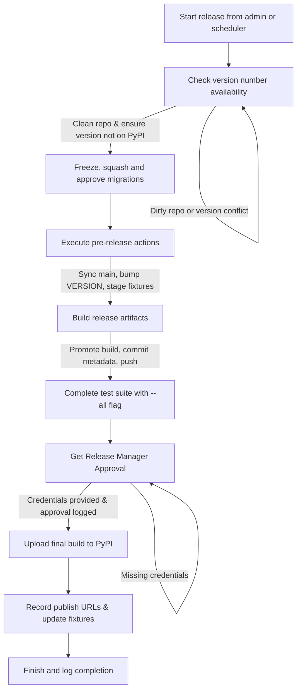

# Package Release Workflow

The publish workflow coordinates multiple guarded steps to move a package version from source control to public repositories. The flow below mirrors the `PUBLISH_STEPS` sequence used by the release UI and the headless scheduler.

## Step-by-step breakdown

1. **Check version number availability** – Syncs with `origin/main`, enforces a clean working tree (auto-committing allowed fixture/`VERSION` changes when possible), and confirms the requested version is newer than the repository state and not already present on PyPI. The step halts on dirty repositories or conflicting versions to avoid accidental overwrites.
2. **Freeze, squash and approve migrations** – Serves as a manual checkpoint to review migration changes. The workflow logs the acknowledgement and expects developers to ensure migrations are consolidated appropriately before proceeding.
3. **Execute pre-release actions** – Refreshes release fixtures, updates the `VERSION` file to the target value, stages the changes, and commits them if anything changed. The workflow also tracks the pre-sync version to support clean restarts.
4. **Build release artifacts** – Re-validates that `origin/main` is unchanged, promotes the build via `release_utils.promote`, and commits any updated metadata (e.g., `VERSION`, release fixtures). The step sets the build revision and renames the log to the release-specific filename, ensuring traceability.
5. **Complete test suite with --all flag** – Captures the expectation that the full test suite has been executed with the `--all` flag. The UI records acknowledgement, keeping the workflow consistent even when tests run externally.
6. **Get Release Manager Approval** – Requires PyPI publishing credentials. For scheduled runs, auto-approval is logged when credentials exist; otherwise the workflow pauses until a release manager approves or rejects the release. Missing credentials are surfaced explicitly in the log.
7. **Upload final build to PyPI** – Publishes to the configured targets (including PyPI and optional GitHub registries), records any warnings, stores the resulting package URLs, and persists fixture updates. The workflow also commits and pushes publish metadata when fixtures change.

## Operational notes

- The same step sequence is executed by the headless scheduler through `run_headless_publish`, which builds a `NodeWorkflow` from `PUBLISH_STEPS` and writes progress logs under `LOG_DIR`.
- Dry-run mode exercises build and publish commands against Test PyPI, restoring `VERSION` and `pyproject.toml` afterward to avoid polluting the working tree.
- Repository hygiene safeguards (dirty checks, syncs against `origin/main`, and build stale detection) ensure releases restart when source changes appear mid-run.
