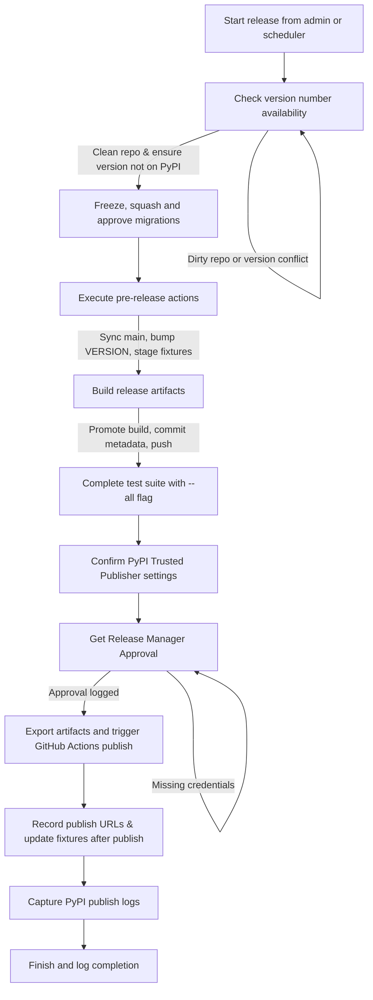

# Package Release Workflow

The publish workflow coordinates multiple guarded steps to move a package version from source control to public repositories. The flow below mirrors the `PUBLISH_STEPS` sequence used by the release UI and the headless scheduler.

## Step-by-step breakdown

1. **Check version number availability** – Syncs with `origin/main`, enforces a clean working tree (auto-committing allowed fixture/`VERSION` changes when possible), and confirms the requested version is newer than the repository state and not already present on PyPI. The step halts on dirty repositories or conflicting versions to avoid accidental overwrites.
2. **Freeze, squash and approve migrations** – Serves as a manual checkpoint to review migration changes. The workflow logs the acknowledgement and expects developers to ensure migrations are consolidated appropriately before proceeding.
3. **Execute pre-release actions** – Refreshes release fixtures, updates the `VERSION` file to the target value, stages the changes, and commits them if anything changed. The workflow also tracks the pre-sync version to support clean restarts.
4. **Build release artifacts** – Re-validates that `origin/main` is unchanged, promotes the build via `release_utils.promote`, and commits any updated metadata (e.g., `VERSION`, release fixtures). The step sets the build revision and renames the log to the release-specific filename, ensuring traceability.
5. **Complete test suite with --all flag** – Captures the expectation that the full test suite has been executed with the `--all` flag. The UI records acknowledgement, keeping the workflow consistent even when tests run externally.
6. **Confirm PyPI Trusted Publisher settings** – Release Managers must verify the PyPI project settings include the Trusted Publisher entry that matches the repository, workflow file, tag pattern, and GitHub environment used by the publish workflow before approving a release.
7. **Get Release Manager Approval** – Requires credentials for the selected publishing mode. OIDC-enabled packages need a GitHub token (for tag pushes and workflow dispatch) instead of PyPI credentials. For scheduled runs, auto-approval is logged when the required credentials exist; otherwise the workflow pauses until a release manager approves or rejects the release. Missing credentials are surfaced explicitly in the log.
8. **Export artifacts and trigger GitHub Actions publish** – Uploads the built wheel/sdist artifacts to the GitHub release for the version tag and dispatches the `publish.yml` workflow so PyPI uploads run via OIDC.
9. **Record publish URLs & update fixtures** – After the GitHub Actions publish completes (and the release is visible on PyPI), the workflow records the PyPI/GitHub URLs, updates fixtures, and commits the publish metadata.
10. **Capture PyPI publish logs** – Downloads the GitHub Actions publish run logs, stores the PyPI upload results, and persists them into the release fixtures for traceability.

## Operational notes

- The same step sequence is executed by the headless scheduler through `run_headless_publish`, which builds a `NodeWorkflow` from `PUBLISH_STEPS` and writes progress logs under `LOG_DIR`.
- Dry-run mode exercises build and publish commands against Test PyPI, restoring `VERSION` and `pyproject.toml` afterward to avoid polluting the working tree.
- Repository hygiene safeguards (dirty checks, syncs against `origin/main`, and build stale detection) ensure releases restart when source changes appear mid-run.

## Publish with PyPI Trusted Publishers (OIDC)

To remove long-lived PyPI API tokens from the release workflow, publishing is delegated to GitHub Actions using PyPI Trusted Publishers (OIDC). This preserves the current release manager approvals while shifting the final publish step to an audited, short-lived credential flow.

### Workflow changes

1. **Enable OIDC publishing on the package** – In the Release Package admin, enable the OIDC publish toggle so the suite knows to skip PyPI credentials and rely on GitHub Actions publishing.
2. **Register a trusted publisher in PyPI** for the `arthexis` project that targets the GitHub Actions workflow used for releases. Capture the required configuration fields (GitHub owner, repository name, workflow filename such as `publish.yml`, and the optional GitHub environment name if using environment protection rules). This ties the project to the repository, workflow file path, and branch or tag protection rules.
3. **Split release into two phases**:
   - The release UI/headless workflow runs through approvals, metadata prep, and artifact generation.
   - The workflow exports built artifacts (wheel/sdist) to the GitHub release and triggers the GitHub Actions `publish` workflow so uploads run with OIDC.
4. **Release publish workflow** (example: `.github/workflows/publish.yml`) that:
   - Has `permissions: id-token: write` and `contents: read`.
   - Downloads the build artifacts from the release process.
   - Uses a pinned `pypa/gh-action-pypi-publish` version (for example, `pypa/gh-action-pypi-publish@v1.8.11`) with `skip-existing: false` and no API token configured, relying on OIDC instead.
5. **Gate publishing with release manager approval** by:
   - Requiring the workflow to be manually dispatched (or triggered by a protected tag) after approval.
   - Using GitHub environment protection rules (required reviewers) to enforce human approval before the publish job runs.
6. **Capture published URLs and logs** by pulling the resulting upload metadata back into the release fixtures (mirroring today’s step 8), ensuring traceability remains intact.

### Implementation notes

- The new `publish.yml` workflow is designed to build from a release tag and publish to PyPI or Test PyPI using OIDC.
- Configure the PyPI trusted publisher to match the repository, workflow path, and tag patterns (for example, `v*`).
- Use the `pypi` environment in GitHub with required reviewers to preserve release manager sign-off before the job publishes.

### PyPI Trusted Publisher configuration (required)

Add (or update) the Trusted Publisher entry in the PyPI project settings for `arthexis` with the exact values below so the OIDC publish workflow can authenticate:

| Setting                    | Value                           | Notes                                                                                          |
| -------------------------- | ------------------------------- | ---------------------------------------------------------------------------------------------- |
| Owner                      | `arthexis`                      |                                                                                                |
| Repository                 | `arthexis`                      |                                                                                                |
| Workflow file              | `.github/workflows/publish.yml` |                                                                                                |
| Workflow ref / tag pattern | `refs/tags/v*`                  | Run the workflow dispatch from the tag so the OIDC `ref` claim matches this pattern.           |
| GitHub environment         | `pypi`                          | Must match `environment: pypi` in `.github/workflows/publish.yml`.                              |

If the workflow is dispatched from a branch (for example, the default branch in the UI), the OIDC `ref` claim will be `refs/heads/<branch>`. In that case, add an additional trusted publisher entry that matches the branch ref (for example, `refs/heads/main`) or ensure the workflow is always dispatched from a release tag.

### Advantages

- **Credential-free publishing**: no API tokens stored in secrets, reducing rotation and leak risk.
- **Auditable, short-lived credentials**: PyPI only trusts GitHub’s OIDC token for the workflow + repository.
- **Clear separation of duties**: release management remains in the UI; publishing is automated and policy-controlled.

## Git authentication for tag pushes

When the release workflow needs to push a tag to GitHub (for example during the
"Export artifacts and trigger GitHub Actions publish" step), the release runner
must be authenticated to `origin`. If the logs show authentication failures
like `fatal: could not read Username for 'https://github.com'`, a release
manager needs to authenticate before retrying the publish step or pushing the
tag manually.

Use one of the following options:

- **Release manager profile**: Add a GitHub personal access token to the `Git
  password/token` or `GitHub token` field in the Release Manager profile so the
  workflow can push tags automatically.
- **Local authentication**: Run `git push origin vX.Y.Z` from an authenticated
  environment (for example a shell with a GitHub token or SSH key configured).

### Next steps

- Identify the release workflow entry point (tag or manual dispatch) and align it with the PyPI trusted publisher settings.
- Prototype the GitHub Actions publish workflow against Test PyPI, then switch the trusted publisher to production once validated.
