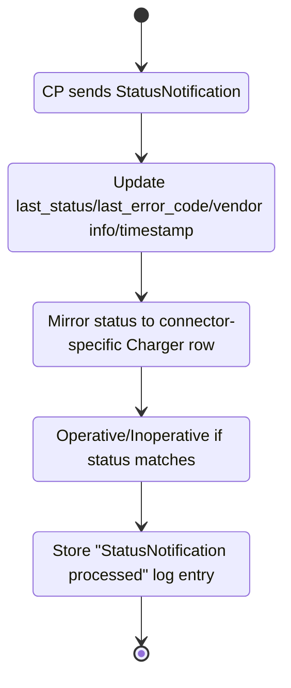
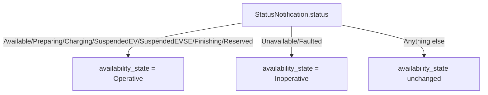
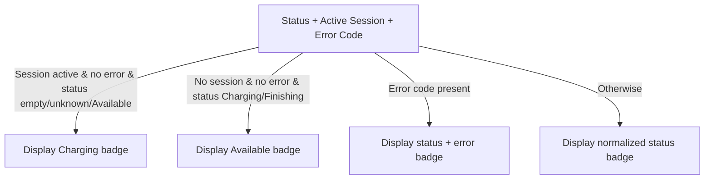

# Charge Point Statuses and Transitions

This document explains the charge point (CP) status values the Arthexis system expects, how each status is recorded, and how those statuses are interpreted for availability and UI presentation.

## Where CP status comes from

Charge points report their status through the OCPP `StatusNotification` message. When a CP sends a `StatusNotification`, the consumer:

- Stores the reported status in `last_status`, along with the error code, vendor info, and timestamp.
- Mirrors the update to the connector-specific `Charger` row when a connector id is provided.
- Logs the processed payload and derives the availability state (Operative/Inoperative) from the reported status.

## Expected CP status values

The system recognizes the following normalized status strings when rendering UI badges and aggregations. These are the canonical lowercase keys used throughout the UI; raw OCPP status values (for example, `Available`, `SuspendedEV`, `SuspendedEVSE`) are normalized by trimming whitespace, collapsing internal spacing, and lowercasing before mapping to these keys.

- `available`
- `preparing`
- `charging`
- `suspendedevse`
- `suspendedev`
- `finishing`
- `faulted`
- `unavailable`
- `reserved`
- `occupied`
- `outofservice`

These values are used to build user-visible status labels and colors and to normalize status display logic. TitleCase values elsewhere in this document refer to raw OCPP values received from the CP, which are matched case-insensitively to the lowercase normalized keys.

## Operative vs. Inoperative availability

Arthexis derives a high-level availability state from OCPP status notifications. The TitleCase values below are raw OCPP status values; they are normalized case-insensitively (trimmed and lowercased) before availability mapping:

- **Operative** statuses: `Available`, `Preparing`, `Charging`, `SuspendedEV`, `SuspendedEVSE`, `Finishing`, `Reserved`.
- **Inoperative** statuses: `Unavailable`, `Faulted`.

If a status notification contains one of these values, the availability state is updated to `Operative` or `Inoperative` accordingly.

## What causes each status

In Arthexis, the direct cause of a CP status is a `StatusNotification` payload from the charge point. The CP controls the value of the status field; the central system records and displays it, normalizes it for presentation, and derives availability where applicable.

Below is a summary of the expected statuses and their immediate cause in this system:

| Status value | Immediate cause in Arthexis | Availability impact |
| --- | --- | --- |
| `available` | CP sends `StatusNotification` with `status=Available`. | Marks availability as Operative. |
| `preparing` | CP sends `StatusNotification` with `status=Preparing`. | Marks availability as Operative. |
| `charging` | CP sends `StatusNotification` with `status=Charging`. | Marks availability as Operative. |
| `suspendedev` | CP sends `StatusNotification` with `status=SuspendedEV`. | Marks availability as Operative. |
| `suspendedevse` | CP sends `StatusNotification` with `status=SuspendedEVSE`. | Marks availability as Operative. |
| `finishing` | CP sends `StatusNotification` with `status=Finishing`. | Marks availability as Operative. |
| `reserved` | CP sends `StatusNotification` with `status=Reserved`. | Marks availability as Operative. |
| `unavailable` | CP sends `StatusNotification` with `status=Unavailable`. | Marks availability as Inoperative. |
| `faulted` | CP sends `StatusNotification` with `status=Faulted`. | Marks availability as Inoperative. |
| `occupied` | CP sends `StatusNotification` with `status=Occupied` (OCPP 2.x). | No availability mapping. |
| `outofservice` | CP sends `StatusNotification` with `status=OutOfService` (OCPP 2.x). | No availability mapping. |

## Transition diagram: StatusNotification processing

## Transition diagram: Availability state derivation

## Transition diagram: UI override rules for display

The UI sometimes overrides the raw status so the badge reflects active transactions. The decision logic is summarized below.

## Notes for operators

- The system does **not** generate status values on its own; it only records what the CP reports.
- If a CP reports non-standard status values, Arthexis will still store them and display the raw value, but availability state changes only occur for the recognized Operative/Inoperative statuses.
